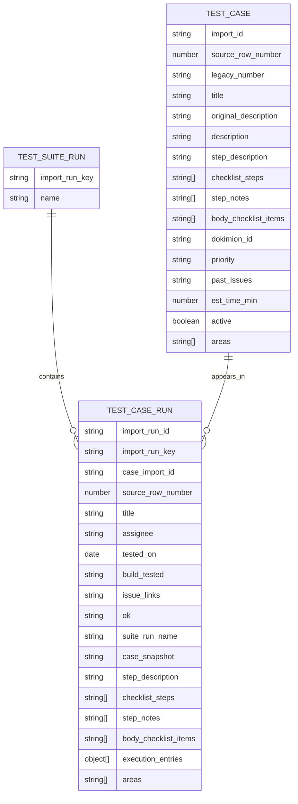
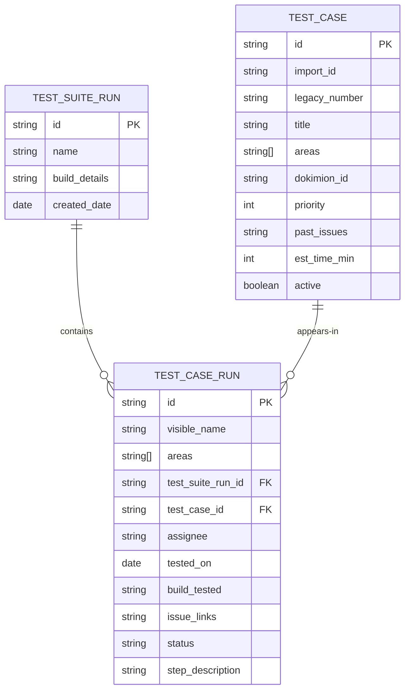

# Round2 Import Schema

## Purpose

This document is the round2 handoff reference.

It is written for someone starting cold who needs to understand:

- what the round2 JSON files are
- how they are produced from the CSV
- which fields are canonical versus helper fields
- how those fields map into the live Notion databases
- which parts of the workflow are preparation versus transport

If this file and the code disagree, the code is authoritative. In practice, the round2 pipeline is intentionally split so that:

- `prepare-import.mjs` interprets and normalizes spreadsheet content
- `import-to-notion.mjs` mostly transports prepared values into Notion

## Files And Roles

### Inputs

- `Bloom Test Plan.csv`
  The source spreadsheet.

- `round2/area-mapping.json`
  Maps spreadsheet heading text into normalized `areas` labels.

- `round2/title-mapping.json`
  Maps difficult rows to better case titles.

- `round2/step-overrides.json`
  Curated per-case overrides for AI-processed step output. Use this when heuristics are not good enough.

- `round2/notion-config.json`
  Stores the target Notion database IDs.

### Generated By `prepare-import.mjs`

The default output folder is `round2/build/`.

- `test-cases.json`
  Canonical prepared case records.

- `test-suite-runs.json`
  Canonical prepared suite-run records.

- `test-case-runs.json`
  Canonical prepared per-run work items.

- `prepare-summary.json`
  Counts and metadata about the preparation pass.

- `date-warnings.json`
  Rows whose run-date values could not be normalized cleanly.

### Generated By `import-to-notion.mjs`

- `notion-state.json`
  Import state keyed by stable import IDs. This is how the importer knows whether to create or update.

- `notion-import-failures.json`
  Append-only failure log for suite runs, cases, and case runs.

The importer may also write body content into Notion pages and reconcile parts of the live schema.

## End-To-End Flow

1. Parse the spreadsheet.
2. Detect area-heading and instruction rows.
3. Turn importable spreadsheet rows into `Test Case` records.
4. Derive one `Test Case Run` per `(case, suite run)` pair that has execution data.
5. Generate processed step fields upstream in JSON.
6. Upload the prepared JSON into the three Notion databases.

The main design rule is:

- semantic interpretation happens in preparation
- Notion upload should not need to rediscover meaning from raw prose

## Core Entities

The round2 model has three entities.

### `Test Suite Run`

One release-testing effort or run header from the spreadsheet.

Examples:

- `6.3`
- `4.9 Spot Testing`
- `5.4 BetaInternal`

### `Test Case`

One reusable test definition derived from a spreadsheet row.

This holds stable case metadata and the processed description fields that later feed run cards.

### `Test Case Run`

One instance of a `Test Case` in one `Test Suite Run`.

This is the actionable work card testers use in Notion.

## Relationship Model

## Prepared JSON Contracts

The sections below describe the actual JSON shape produced by `prepare-import.mjs` today.

## `test-cases.json`

Each object represents one reusable test case.

### Required fields in practice

- `importId`
  Stable primary key for the case inside the import pipeline.

- `sourceRowNumber`
  Original CSV row number.

- `title`
  Human-friendly short title used in Notion.

- `description`
  Prepared long-form description. This is the case page body source, not the raw spreadsheet text.

- `stepDescription`
  Short preview string for board cards and dense views.

- `bodyChecklistItems`
  Canonical checklist content for run-card page bodies.

- `areas`
  Normalized area tags inherited from heading context.

### Other fields

- `legacyNumber`
  Spreadsheet legacy identifier when present.

- `originalDescription`
  Raw description cell content before instruction prefixes or step interpretation. Keep this for future review or reprocessing.

- `checklistSteps`
  Action-oriented subset of processed steps. Helpful for debugging or review, but not the canonical field used by the importer when `bodyChecklistItems` exists.

- `stepNotes`
  Verification or note-like lines split out during processing. Helpful for review; combined into `bodyChecklistItems` for import.

- `dokimionId`
  External test identifier.

- `priority`
  Normalized priority label. Allowed values currently normalize to `1`, `2`, `3`, `Ignore`, or `Duplicate`.

- `pastIssues`
  Historical issue references, often `BL-` IDs.

- `estTimeMin`
  Estimated time in minutes, or `null`.

- `active`
  Currently always `true` for imported active cases.

### Canonical interpretation

For future work, treat these fields as canonical in this order:

- `originalDescription` = raw source of truth
- `description` = prepared long-form case text
- `stepDescription` = short preview
- `bodyChecklistItems` = final checklist content intended for Notion run-card bodies

`checklistSteps` and `stepNotes` are intermediate review aids, not required for final rendering.

## `test-suite-runs.json`

Each object represents one run header discovered from the spreadsheet.

### Fields

- `importRunKey`
  Stable import key for the suite run. This is the suite-run identifier used in import state and in `Test Case Run` records.

- `name`
  Display name preserved from the spreadsheet header.

- `runOrder`
  Relative order discovered from the spreadsheet. Useful in preparation, but not currently sent to the live `Test Suite Runs` database.

- `historicalImport`
  Preparation-only flag used during import logic in older iterations. The live round2 schema does not need this property.

## `test-case-runs.json`

Each object represents one actionable card for one case in one suite run.

### Identity and relations

- `importRunId`
  Stable primary key for the run card. Format: `caseImportId::suiteRunKey`.

- `importRunKey`
  Foreign-key style reference to the suite run.

- `caseImportId`
  Foreign-key style reference to the test case.

### Execution fields

- `title`
  Card title shown in Notion. Usually derived from the case title.

- `assignee`
  Imported assignee label from the spreadsheet.

- `testedOn`
  Normalized ISO-like date string when available.

- `buildTested`
  Build information from the execution columns.

- `issueLinks`
  Issue references aggregated across the grouped execution entries for the suite run.

- `ok`
  Normalized raw OK flag from the spreadsheet. This is still present in JSON because status is derived from it during import.

- `suiteRunName`
  Human-readable suite-run name.

### Prepared content fields

- `caseSnapshot`
  Copy of the case `description` at preparation time.

- `stepDescription`
  Short preview for the run card.

- `checklistSteps`
  Action-oriented prepared steps.

- `stepNotes`
  Verification or note-like lines.

- `bodyChecklistItems`
  Canonical checklist body imported into Notion as unchecked `to_do` blocks.

- `executionEntries`
  Raw grouped execution rows that fed this case run.

- `areas`
  Same normalized area tags as the source case.

## Status Derivation

`Test Case Run` status is not stored as a final prepared field. It is derived during import from the execution data.

Current rule:

- if `ok === '__YES__'`, `Status = Done`
- else if there is no assignee, leave status blank
- else if there are issue links, `Status = Problems`
- else `Status = In Progress`

This logic lives in `round2/import-to-notion.mjs`.

## Step Processing Model

The round2 preparation phase tries to turn spreadsheet prose into three useful layers.

### `description`

This is the readable long-form case text. It may include inherited instruction text from an area heading, such as a repeated setup instruction.

### `stepDescription`

This is a compressed preview built from the first few processed action steps. It exists because Notion board cards cannot display page-body checklist blocks.

### `bodyChecklistItems`

This is the final checklist that should appear in the `Test Case Run` page body.

The current preparation algorithm builds it as:

- all deduped action steps
- followed by deduped verification or note lines

### Why `checklistSteps` and `stepNotes` still exist

They are useful for:

- debugging weak heuristics
- curated review passes
- future refinement of action-vs-verification logic

They are not required by the importer when `bodyChecklistItems` is present.

## Area And Instruction Rows

Not every spreadsheet row becomes a case.

The preparation pass first classifies rows such as:

- area headings
- instruction rows
- ignorable context rows

Effects:

- area-heading rows feed the `areas` array on later cases
- instruction rows may prepend reusable setup text into `description`
- those context rows are not imported as standalone cases unless they also contain real case content

Example pattern already in use:

- an installer heading can add `Installer` to `areas`
- a heading like `set OS culture to es-MX and try the following` can be prepended to later case descriptions in that area

## Live Notion Databases

The target database IDs live in `round2/notion-config.json`.

Current keys:

- `testCases`
- `testSuiteRuns`
- `testCaseRuns`

The importer reconciles the live schema enough to support the current round2 contract. This document describes the live property contract the importer expects today.

## Notion Mapping: `Test Cases`

Database title property name:

- `Test Case`

Properties written by `buildCaseProperties()`:

- `Test Case` -> Notion `title`
  From `record.title`

- `Import ID` -> Notion `rich_text`
  From `record.importId`

- `Original Description` -> Notion `rich_text`
  From `record.originalDescription`

- `Source Row Number` -> Notion `number`
  From `record.sourceRowNumber`

- `Legacy Number` -> Notion `rich_text`
  From `record.legacyNumber`

- `Dokimion ID` -> Notion `rich_text`
  From `record.dokimionId`

- `Past Issues` -> Notion `rich_text`
  From `record.pastIssues`, with `BL-1234` style references converted to hyperlinks

- `Areas` -> Notion `multi_select`
  From `record.areas`

- `Active` -> Notion `checkbox`
  From `record.active`

- `Priority` -> Notion `select`
  Optional, from `record.priority`

- `Est. Time (min)` -> Notion `number`
  Optional, from `record.estTimeMin`

Case page body behavior:

- The importer writes the case page body from `record.description`
- Each non-empty line becomes a paragraph block

## Notion Mapping: `Test Suite Runs`

Database title property name:

- `Test Suite Run`

Properties written by `buildSuiteRunProperties()`:

- `Test Suite Run` -> Notion `title`
  From `record.name`

- `Import Run Key` -> Notion `rich_text`
  From `record.importRunKey`

Important live-schema note:

- do not send `Run Order` to the live `Test Suite Runs` database; that property does not exist live

Suite-run page body behavior:

- no page-body blocks are currently written

## Notion Mapping: `Test Case Runs`

Database title property name:

- `Test Case Run`

Properties written by `buildCaseRunProperties()`:

- `Test Case Run` -> Notion `title`
  From `record.title`

- `Import Run ID` -> Notion `rich_text`
  From `record.importRunId`

- `Step Description` -> Notion `rich_text`
  From `record.stepDescription`

- `Areas` -> Notion `multi_select`
  From `record.areas`

- `Test Suite Run` -> Notion `relation`
  Related suite-run page ID resolved via import state or lookup

- `Test Case` -> Notion `relation`
  Related case page ID resolved via import state or lookup

- `Build Tested` -> Notion `rich_text`
  From `record.buildTested`

- `Issue Links` -> Notion `rich_text`
  From `record.issueLinks`, with `BL-1234` style references converted to hyperlinks

- `Source Row Number` -> Notion `number`
  From `record.sourceRowNumber`

- `Assignee` -> Notion `select`
  From `record.assignee`

- `Status` -> Notion `status`
  Derived from `record.ok`, `record.assignee`, and `record.issueLinks`

- `Tested On` -> Notion `date`
  From `record.testedOn`

Run-card page body behavior:

- if `bodyChecklistItems` exists, each item becomes an unchecked Notion `to_do` block
- otherwise the importer falls back to `checklistSteps` plus `stepNotes`
- if neither exists, it falls back to paragraph blocks from `caseSnapshot`

For current round2 behavior, the intended body source is `bodyChecklistItems`.

## Live Schema Reconciliation

`import-to-notion.mjs` can reconcile parts of the live schema before import.

Current behavior:

- removes obsolete `Notes Link` from `Test Cases` if present
- removes obsolete `Historical Import` from `Test Cases` and `Test Suite Runs` if present
- ensures `Areas` exists on `Test Cases`, using `Test Case Runs` area options when available
- ensures `Original Description` exists on `Test Cases`
- removes obsolete `Case Summary`, `Historical Import`, and `OK` from `Test Case Runs` if present
- ensures `Status` exists on `Test Case Runs`
- ensures `Step Description` exists on `Test Case Runs`

Important live-schema facts already verified in this workspace:

- in `Test Case Runs`, `Assignee` is a `select`, not a `people` field
- in `Test Case Runs`, `Status` is a `status` property
- in `Test Case Runs`, `Step Description` is `rich_text`
- in `Test Suite Runs`, `Run Order` should not be sent

## Import State And Identity

The importer is designed to be rerunnable.

State keys:

- suite runs are keyed by `importRunKey`
- cases are keyed by `importId`
- case runs are keyed by `importRunId`

This means the stable identifiers are:

- `Test Case.importId`
- `Test Suite Run.importRunKey`
- `Test Case Run.importRunId`

If a page ID is already present in `notion-state.json`, the importer updates that page.
If not, and lookup is allowed, it can query the live database by the corresponding import key.

## Page Body Replacement Behavior

The importer supports two body modes.

- default mode: only append blocks if the page body is empty
- replacement mode: delete existing child blocks and replace the body completely

Current environment flag:

- `ROUND2_REPLACE_BODY=1`

Use replacement mode when the prepared checklist/body format changes and old content should be discarded.

## Useful Environment Variables

### Preparation

- `ROUND2_CASE_OFFSET`
  Skip that many importable cases before producing output.

- `ROUND2_LIMIT_CASES`
  Limit the number of importable cases written.

### Import

- `ROUND2_ALLOW_LOOKUP`
  Enable live lookup by import ID when state is missing.

- `ROUND2_SKIP_SUITE_RUNS`
  Skip suite-run import.

- `ROUND2_SKIP_CASES`
  Skip case import.

- `ROUND2_SKIP_CASE_RUNS`
  Skip case-run import.

- `ROUND2_RECONCILE_SCHEMA`
  Enable live schema reconciliation.

- `ROUND2_RESET_EXISTING`
  Archive existing pages in the three databases before import.

- `ROUND2_REPLACE_BODY`
  Replace existing page-body content instead of leaving it alone.

- `ROUND2_RETRY_COUNT`
  Retry count for Notion API calls.

- `ROUND2_RETRY_DELAY_MS`
  Base retry delay.

- `ROUND2_REQUEST_TIMEOUT_MS`
  Timeout per Notion request.

## Auxiliary Output Files

### `prepare-summary.json`

Contains a compact summary of the preparation pass, including:

- source CSV path
- output directory
- case offset and limit
- slot count
- test case count
- test suite run count
- test case run count
- date warning count
- area count
- area mapping path

Use this as a fast sanity check after regeneration.

### `date-warnings.json`

Contains rows where date normalization was not clean. Review this if imported `Tested On` coverage looks wrong.

### `notion-state.json`

Persistent mapping from import keys to Notion page IDs. Treat it as operational state, not a source document.

### `notion-import-failures.json`

Operational error log. Empty arrays mean the latest import pass completed cleanly for that entity type.

## Known Limitations

- The heuristic step parser is intentionally lightweight and produces weak results on some complex prose rows.
- `stepDescription` quality is only as good as the inferred or overridden steps.
- `checklistSteps` and `stepNotes` are useful for diagnostics but increase JSON surface area.
- `ok` still exists in prepared run JSON because status is derived later rather than materialized upstream.

## Recommended Mental Model For Future Work

When changing round2, use this order of concern:

1. Preserve `originalDescription` so source intent is never lost.
2. Improve preparation quality in `prepare-import.mjs` or `step-overrides.json`.
3. Keep `import-to-notion.mjs` focused on mapping and transport.
4. Treat `bodyChecklistItems` as the final intended page-body contract.
5. Verify against the live Notion schema, not just this document.

## Practical Scratch-Start Checklist

If you had no session memory and needed to resume this work from scratch, the minimum facts to know are:

- `round2/prepare-import.mjs` creates three canonical JSON files plus summary and warning files
- `round2/import-to-notion.mjs` uploads those files into three Notion databases defined in `round2/notion-config.json`
- `Test Case Runs` are the actionable cards
- `Status` replaces the old `OK` field in Notion
- `Status` is derived, not stored directly in prepared JSON
- `Step Description` is the short board-card preview
- `bodyChecklistItems` is the final checklist content for run-card page bodies
- `originalDescription` preserves the raw spreadsheet text for review and future reprocessing
- `round2/step-overrides.json` is the intended place for curated per-case fixes when heuristics are weak
- the live Notion schema matters more than older design assumptions

That is the round2 contract.# Test Case Management Schema

## Summary

This schema is intentionally small. It models:

- `Test Suite Run`: one release-testing effort, such as `6.3` or `4.9 Spot Testing`
- `Test Case`: one reusable test definition
- `Test Case Run`: one test case as included in one specific suite run

The design matches the spreadsheet and the intended Notion workflow:

- the first spreadsheet row contains distinct historical run names
- each run name should be preserved exactly
- a new run creates a set of per-case cards to work through
- testers assign themselves to those cards and record the outcome
- test case runs use a `Status` field with `Done`, `In Progress`, and `Problems`
- test case runs also carry a short `Step Description` preview for board cards
- issue links are stored explicitly and BL- references should be hyperlink-rich text
- each `Test Case Run` keeps the actionable test steps in the page body as a checklist plus any short verification notes
- long-form descriptions, notes, and images should live in the page body, not duplicate database properties

## Entity Model

## Why These Three Entities

### Test Suite Run

This is the top-level release validation effort.

Examples:

- `6.3`
- `4.9 Spot Testing`
- `4.9 B`

Each header in the first spreadsheet row becomes one `Test Suite Run`.

Even though there is only one effective suite right now, `Test Suite Run` is acceptable terminology as long as it consistently means the whole set of tests being worked for that release pass.

### Test Case

This is the reusable master definition of a test. It stores the durable metadata about what the test is, how important it is, and any supporting identifiers that belong to the test itself rather than to a particular release run.

The full test description should live in the Notion page body for the `Test Case` page.

### Test Case Run

This is the per-run work item or card. It connects one `Test Case` to one `Test Suite Run` and holds the data specific to performing that case in that run.

This is where the tester:

- assigns themselves
- records the date
- records build-specific details if needed
- updates `Status`
- adds issue links
- works from the checklist in the page body

This entity is the key to the whole design. It is the instance of a test case within a specific release-testing effort.

The page body should hold the runnable checklist plus any short verification notes. Execution metadata belongs in database properties, not repeated in the page body.

## Notion Type Guidance

The schema above is logical. In Notion, each entity should be implemented as its own database, and each database must have exactly one `title` property.

In Notion API terms, the free-form body of a card is the page content, and that content is stored as blocks. It is not a database property type. Each row in a Notion database is a page, so long-form descriptions, notes, screenshots, and copied snapshots can live in the page body instead of separate rich-text properties.

The property types below are based on Notion's supported database property types, including `title`, `rich_text`, `number`, `checkbox`, `date`, `people`, `relation`, and `created_time`.

Two practical Notion-specific rules matter here:

- Use `relation` for foreign-key style links between databases.
- Use `rich_text` instead of `url` when a field may need to hold multiple hyperlinks or mixed text.

### TEST_SUITE_RUN Notion Properties

- `name` -> `title`
  This is the required primary display field for the `Test Suite Run` database.

- `build_details` -> `rich_text`
  Short build/version notes for the run as a whole. Longer run notes should go in the page body.

- `created_date` -> `created_time`
  Prefer Notion's built-in created timestamp rather than maintaining a manual date field.

Optional derived properties for the `Test Suite Run` database:

- `test_case_runs` -> `relation` to `TEST_CASE_RUN`
- `total_cases` -> `rollup` over related `TEST_CASE_RUN` records
- `done_cases` -> `rollup` or filtered count over related `TEST_CASE_RUN.status`

### TEST_CASE Notion Properties

- `title` -> `title`
  This should be the primary display field for the `Test Case` database.

- `import_id` -> `rich_text`
  Stable external identifier used by the import pipeline.

- `legacy_number` -> `rich_text`
  Best stored as text because legacy identifiers often stop behaving like pure numbers.

- `dokimion_id` -> `rich_text`
  External identifier.

- `areas` -> `multi_select`
  Area headings captured from the spreadsheet so cases can be grouped and filtered in Notion.

- `priority` -> `number`
  Use `select` instead if the team later standardizes on labels such as `High`, `Medium`, `Low`.

- `past_issues` -> `rich_text`
  Use this instead of `url` because this field may hold multiple issue links or short annotations.

- `original_description` -> `rich_text`
  Preserve the raw imported description text so humans or later review passes can compare it with the processed checklist.

- `est_time_min` -> `number`
  Estimated execution time in minutes.

- `active` -> `checkbox`
  Marks whether the case is in the active catalog.

`Test Case` page body:

- Store the actual test description, preconditions, steps, screenshots, supporting links, and other rich content in the page body as blocks rather than in duplicate database properties.

Optional derived properties for the `Test Case` database:

- `test_case_runs` -> `relation` to `TEST_CASE_RUN`
- `suite_runs` -> `rollup` or derived view via related `TEST_CASE_RUN`

### TEST_CASE_RUN Notion Properties

- `name` -> `title`
  Notion requires a `title` property here too. Copy the short `Test Case` title so the card remains readable in views that cannot yet display the related case title inline.

- `areas` -> `multi_select`
  Mirror the case areas on each run card so the same filters work in run-level views.

- `test_suite_run_id` -> `relation` to `TEST_SUITE_RUN`
  This is the Notion equivalent of the foreign key.

- `test_case_id` -> `relation` to `TEST_CASE`
  This is the Notion equivalent of the foreign key.

- `assignee` -> `people`
  Use `people` if the assignee is always a Notion workspace user. Use `rich_text` only if names must be imported as plain text without matching users.

- `tested_on` -> `date`
  Date the case was worked in that run.

- `build_tested` -> `rich_text`
  Card-specific build detail when it differs from run-level notes.

- `issue_links` -> `rich_text`
  This should remain `rich_text` rather than `url` because the spreadsheet allows one or more issue links. BL- values should be imported as hyperlinks to YouTrack.

- `status` -> `select`
  Use `Done`, `In Progress`, and `Problems` for the current imported workflow.

- `step_description` -> `rich_text`
  A short preview of what the tester will do, intended for Kanban cards and other dense views.

`Test Case Run` page body:

- Store the actionable checklist as `to_do` blocks plus any short verification notes. Do not repeat assignee, date, build, or status in the page body.

Useful optional helper properties for the `Test Case Run` database:

- `created_time` -> `created_time`
- `last_edited_time` -> `last_edited_time`

## Field Notes

### TEST_SUITE_RUN

- `id`
  Internal primary key.

- `name`
  Exact run name from the spreadsheet header or from future manual creation. Preserve the original text exactly.

- `build_details`
  Short release/build information for the run as a whole. Longer notes belong in the page body.

- `created_date`
  When the run record was created.

### TEST_CASE

- `id`
  Internal primary key.

- `import_id`
  Stable import identifier from the spreadsheet/import pipeline.

- `legacy_number`
  Original test number or legacy identifier if present.

- `title`
  Short scan-friendly label for the test case, ideally a few words rather than the full instruction sentence.

- `areas`
  One or more spreadsheet area headings carried onto the case.

- `dokimion_id`
  Existing external identifier if that remains useful.

- `priority`
  Priority value for sorting or filtering.

- `past_issues`
  Historical issue references associated with the test case definition.

- `est_time_min`
  Estimated execution time in minutes.

- `active`
  Whether the case is currently considered part of the active catalog.

### TEST_CASE_RUN

- `id`
  Internal primary key.

- `test_suite_run_id`
  Foreign key to the containing `Test Suite Run`.

- `test_case_id`
  Foreign key to the reusable `Test Case`.

- `assignee`
  The person currently working the card.

- `tested_on`
  Date the case was worked in this run.

- `build_tested`
  Optional build detail for this specific card if it differs from the run-level build details.

- `areas`
  Copy of the related `Test Case` areas for filtering and grouping in Notion views.

- `issue_links`
  One or more hyperlinks to issues found while executing the case.

- `status`
  The current imported outcome value. Use `Done`, `In Progress`, or `Problems`.

### Page Body Content

In Notion, every database row is a page, and the free-form content area of that page is page content stored as blocks.

Use that page body for content that is naturally document-like:

- `Test Suite Run` page body: run notes, screenshots, release context, ad hoc commentary
- `Test Case` page body: full test description, preconditions, steps, expected behavior, images, supporting text
- `Test Case Run` page body: actionable checklist items plus short verification notes

## Design Decisions

### No Separate Test Result Entity

There is no separate `Test Result` table. The result data lives directly on `Test Case Run` because the system only needs a simple `Status` outcome plus notes and issues.

### No Separate Test Report Entity

There is no `Test Report` entity. Summary views such as counts of completed tests or problem tests should be derived from the set of `Test Case Run` records in a given `Test Suite Run`.

### No Skip Modeling in Schema

Skip is intentionally not modeled as a database concept right now. If a test should not be part of a run, that is handled by run composition in the UX rather than by a dedicated schema field.

### Checklist Required for Historical Accuracy

`Test Case Run` should preserve the runnable checklist and short verification notes in its page body so historical runs continue to reflect what testers used at the time.

## Spreadsheet Import Mapping

### Top Row

Each value in the first spreadsheet row becomes one `Test Suite Run.name`.

Examples:

- `6.3`
- `6.0`
- `5.4 BetaInternal`
- `4.9 Spot Testing`

These names should be preserved exactly.

### Shared Test Columns

The columns that define the test itself map into `Test Case`.

Likely examples include:

- import identifier
- legacy test number
- short case title
- areas derived from heading rows
- priority
- estimated time
- historical issue references

The full test description and any supporting links should be imported into the `Test Case` page body rather than into separate properties.

### Per-Run Column Groups

Each run-specific column group becomes one `Test Case Run` for the corresponding case and run.

Typical mappings:

- `Person` -> `assignee`
- `Date` -> `tested_on`
- `Build` -> `build_tested`
- `Issue(s)` -> `issue_links`
- `OK?` -> `status`

Checklist steps and any short verification notes should be imported into the `Test Case Run` page body.

## Practical Interpretation in Notion

In Notion terms:

- `Test Suite Run` is one database of runs
- `Test Case` is one database of reusable cases
- `Test Case Run` is one database of per-run cards related to both of the above

Recommended primary Notion property choices:

- `Test Suite Run.title` = run name
- `Test Case.title` = test case title
- `Test Case.areas` = area tags from spreadsheet heading rows
- `Test Case Run.title` = copied `Test Case` title
- `Test Case Run.areas` = copied area tags from the related case

Recommended relation setup:

- `Test Case Run` relates to one `Test Suite Run`
- `Test Case Run` relates to one `Test Case`
- reciprocal relation properties can be shown on the other two databases as needed

That gives the desired workflow:

1. Create a new `Test Suite Run`.
2. Generate `Test Case Run` cards for the cases included in that run.
3. Team members grab unassigned cards.
4. Team members update `Status`, issue links, notes, and any build details.

## Recommended Constraints

- A `Test Case Run` must belong to exactly one `Test Suite Run`.
- A `Test Case Run` must belong to exactly one `Test Case`.
- A `Test Case` can appear in many `Test Suite Run`s over time.
- A `Test Suite Run` can contain many `Test Case Run`s.
- In the default model, there should be at most one `Test Case Run` per `(test_suite_run_id, test_case_id)` pair.

That last rule keeps the model simple and matches the current workflow. If retesting within the same run ever becomes important, that can be extended later.

## Final Recommendation

Use these three core entities:

- `Test Suite Run`
- `Test Case`
- `Test Case Run`

This is the smallest schema that:

- matches the spreadsheet structure
- preserves historical run data
- supports future release testing in Notion
- keeps the workflow card-based and simple
- avoids over-modeling reports, results, and skip states

## Areas

Rows in the spreadsheet that act as section headings should be treated as areas, not imported as test cases.

Those headings should be carried forward onto subsequent `Test Case` and `Test Case Run` records as one or more `Areas` tags.

If a heading row is really shorthand for a repeated instruction, use a cleaned area label and copy the instruction text into each affected test description.

Examples from the spreadsheet include:

- `Installing : set OS culture to es-MX and try the following` -> area label `Installer`, instruction copied into affected test descriptions
- `Startup & Recovery Issues`
- `Authoring`
- `Publishing: PDF`
